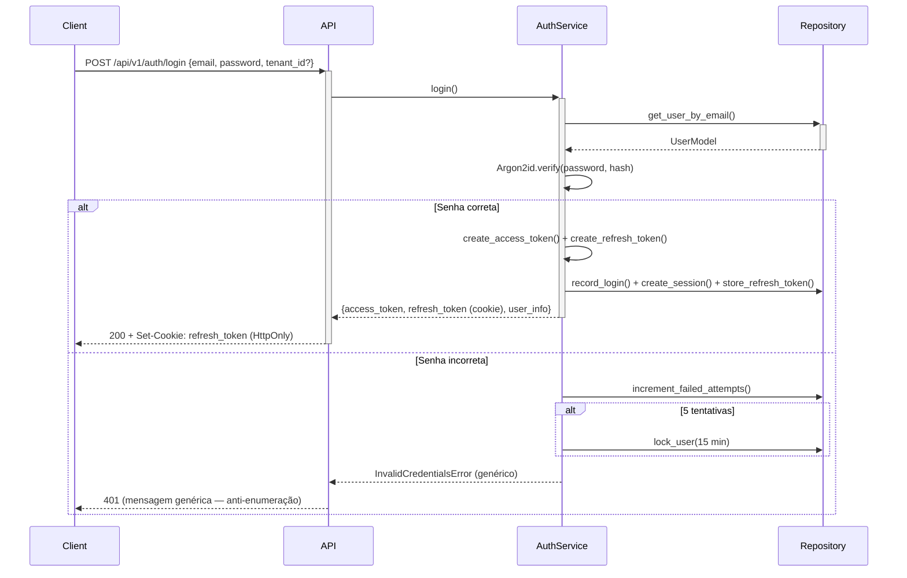

# 🔐 Módulo de Autenticação — Documentação

> **Versão:** 1.0.0 | **Data:** Julho 2026 | **Módulo:** `app.modules.auth`

---

## 1. Visão Geral

O módulo de autenticação implementa o sistema completo de identidade, acesso e autorização do Barbershop SaaS, seguindo os princípios:

- **Defense in Depth** — Múltiplas camadas de proteção
- **Least Privilege** — Cada usuário acessa apenas o necessário
- **Secure by Default** — Configurações padrão são as mais seguras
- **Zero Trust** — Nenhuma confiança implícita

### 1.1 Arquitetura do Módulo

```
app/modules/auth/
├── domain/                    # Entidades, Value Objects, Interfaces (portas)
│   ├── entities.py            # User, Role, Session, RefreshToken
│   ├── value_objects.py       # Email, Password, TenantId
│   └── interfaces.py          # IUserRepository, ITokenService (contratos)
├── application/               # Casos de uso (orquestração)
│   ├── auth_service.py        # AuthService — login, refresh, logout, reset
│   └── dto.py                 # DTOs de entrada/saída (Pydantic)
├── infrastructure/            # Implementações concretas (adaptadores)
│   ├── models/                # SQLAlchemy ORM models (7 modelos)
│   │   └── auth_models.py     # UserModel, RoleModel, SessionModel, etc.
│   ├── repository.py          # AuthRepository — implementa IUserRepository
│   └── security.py            # Argon2id, JWT, tokens opacos
└── presentation/              # API REST (adaptadores de entrada)
    ├── routes.py              # 10 endpoints REST
    └── dependencies.py        # FastAPI dependencies (RBAC, tenant match)
```

---

## 2. Fluxo de Autenticação

### 2.1 Login



### 2.2 Refresh Token Rotation

```
Cada uso do refresh token:
  1. Valida token opaco contra hash no banco
  2. Revoga o token atual (single-use)
  3. Emite novo access token + novo refresh token
  4. Se token já revogado for reusado → revoga TODA a família (roubo detectado)
```

### 2.3 Logout

- **Logout simples**: Revoga apenas o refresh token atual + session atual
- **Logout-all**: Revoga TODA a família de refresh tokens + TODAS as sessões

---

## 3. Segurança de Senhas

| Parâmetro | Valor | Justificativa |
|-----------|-------|---------------|
| **Algoritmo** | Argon2id | Vencedor PHC 2015, resistente a GPU/ASIC |
| **time_cost** | 3 | 3 iterações (~0.5s em CPU moderna) |
| **memory_cost** | 65536 (64 MB) | Custo alto de memória impede ataque paralelo |
| **parallelism** | 4 | 4 threads |
| **hash_len** | 32 | 256 bits de saída |
| **Salt** | 16 bytes aleatórios | Embutido no hash Argon2 |

### Rehash automático

No login, se os parâmetros do Argon2 forem atualizados (ex: aumentar memory_cost), o hash é automaticamente recalculado com os novos parâmetros e salvo no banco — sem interromper o usuário.

### Política de Senhas (NIST 800-63B)

- ✅ Mínimo 8 caracteres
- ✅ Sem requisitos de complexidade (maiúscula, símbolo, etc.)
- ✅ Verificação contra senhas comuns (Have I Been Pwned — planejado)
- ❌ Sem expiração forçada (contraproducente)
- ❌ Sem dicas de senha

---

## 4. Tokens

### 4.1 Access Token (JWT)

| Campo | Valor |
|-------|-------|
| **Formato** | JWT (HS256) |
| **Expiração** | 15 minutos |
| **Claims** | `sub`, `tenant_id`, `role`, `permissions`, `iat`, `exp`, `jti`, `type=access` |
| **Transmissão** | Header `Authorization: Bearer <token>` |
| **Tamanho** | ~400 bytes |

### 4.2 Refresh Token

| Campo | Valor |
|-------|-------|
| **Formato** | Opaque (64 bytes hex = 128 chars) |
| **Expiração** | 7 dias |
| **Armazenamento** | Hash SHA-256 no banco; valor bruto no cookie |
| **Transmissão** | Cookie HttpOnly, Secure, SameSite=Strict |
| **Rotação** | Rotacionado a cada uso (single-use) |
| **Família** | Agrupado por `family_id` para detecção de reuso |

---

## 5. Lockout de Conta

| Parâmetro | Valor |
|-----------|-------|
| **Tentativas máximas** | 5 |
| **Duração do bloqueio** | 15 minutos |
| **Contador** | `failed_login_attempts` no UserModel |
| **Reset** | Automático após login bem-sucedido |
| **Mensagem** | Genérica — não revela se conta existe ou está bloqueada |

---

## 6. Sessões

Cada login cria uma sessão rastreável:

| Campo | Descrição |
|-------|-----------|
| `id` | UUID v4 |
| `user_id` | FK → UserModel |
| `ip_address` | IP do cliente |
| `user_agent` | User-Agent do navegador/app |
| `device_type` | web / ios / android |
| `is_active` | Status da sessão |
| `expires_at` | Data de expiração |
| `created_at` / `updated_at` | Timestamps |

O usuário pode visualizar e revogar sessões individuais ou todas de uma vez.

---

## 7. 6 Tipos de Usuário (RBAC)

| # | Role | Escopo | Descrição |
|---|------|--------|-----------|
| 1 | **super_admin** | Global (cross-tenant) | Administrador da plataforma SaaS |
| 2 | **owner** | Tenant | Dono da barbearia |
| 3 | **admin** | Tenant | Gerente/administrador da barbearia |
| 4 | **barber** | Tenant | Barbeiro/profissional |
| 5 | **receptionist** | Tenant | Recepcionista/atendente |
| 6 | **customer** | Tenant | Cliente final |

### Estrutura de Permissões

```json
// Exemplo: role "barber"
{
  "name": "barber",
  "permissions": [
    "booking:read:assigned",
    "booking:write:own",
    "schedule:read:own",
    "customer:read",
    "profile:read:own",
    "profile:write:own"
  ]
}
```

Permissões seguem o padrão `resource:action[:scope]`.

---

## 8. Middleware de Segurança

### 8.1 Rate Limiting (planejado)

| Endpoint | Limite | Janela |
|----------|--------|--------|
| `/auth/login` | 5 req/min por IP | 60s sliding window |
| `/auth/forgot-password` | 3 req/min por IP | 60s |
| `/auth/*` (demais) | 60 req/min por IP | 60s |

Implementação: Redis + sliding window algorithm.

### 8.2 CSRF Protection (planejado)

- Token CSRF em cookie `SameSite=Strict`
- Header `X-CSRF-Token` obrigatório em mutations (POST/PUT/DELETE)
- Double-submit cookie pattern

### 8.3 Content-Security-Policy (planejado)

- Header CSP sem `unsafe-inline`
- Nonce-based para scripts inline necessários

---

## 9. Auditoria e Logs

Toda ação sensível é registrada na tabela `login_logs`:

- ✅ Login (sucesso/falha)
- ✅ Logout
- ✅ Refresh token rotation
- ✅ Mudança de senha
- ✅ Reset de senha
- ✅ Bloqueio de conta

---

## 10. Resumo de Segurança

| Controle | Status |
|----------|:------:|
| Argon2id password hashing | ✅ Implementado |
| JWT access tokens (15 min) | ✅ Implementado |
| Opaque refresh tokens + rotação | ✅ Implementado |
| HttpOnly cookies (refresh token) | ✅ Implementado |
| RBAC com permissões granulares | ✅ Implementado |
| Account lockout (5 tentativas) | ✅ Implementado |
| Anti-enumeração (mensagens genéricas) | ✅ Implementado |
| Tenant isolation (dependency) | ✅ Implementado |
| Session tracking + revogação | ✅ Implementado |
| Rate limiting (Redis) | 🔲 Pendente |
| CSRF protection | 🔲 Pendente |
| CSP headers | 🔲 Pendente |
| Have I Been Pwned check | 🔲 Pendente |
