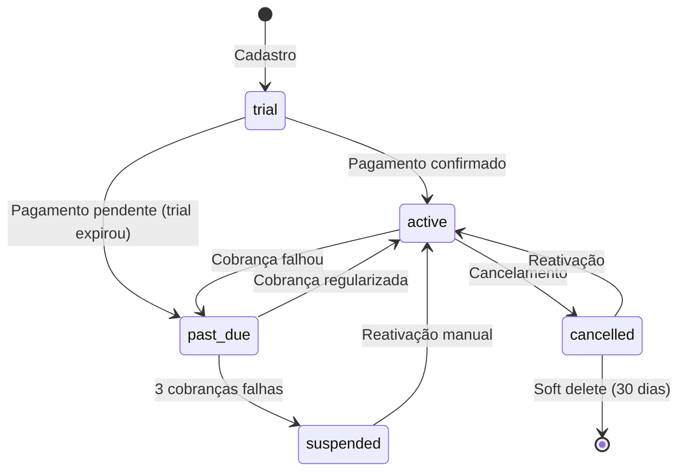

# 🏢 Módulo Multi-Tenant — Documentação

> **Versão:** 1.0.0 | **Data:** Julho 2026 | **Módulo:** `app.modules.tenant`

---

## 1. Visão Geral

O módulo multi-tenant é a **fundação do SaaS**. Define como empresas, workspaces, planos, assinaturas e branding funcionam. Inspirado em plataformas como **Shopify** (white-label), **Stripe** (billing), **Slack** (workspaces) e **Notion** (colaboração).

### 1.1 Arquitetura do Módulo

```
app/modules/tenant/
├── domain/                         # Entidades, Value Objects, Interfaces
│   ├── entities.py                 # Tenant (AR), Plan, Subscription, etc.
│   ├── value_objects.py            # Subdomain, PlanLimits, BrandingColors
│   ├── enums.py                    # TenantStatus, SubscriptionStatus, etc.
│   └── interfaces.py               # Ports: ITenantRepository, IPlanRepository, etc.
├── application/                    # Casos de uso
│   ├── tenant_service.py           # TenantService — orquestração
│   ├── plan_service.py             # PlanService — planos e assinaturas
│   └── dto.py                      # DTOs de entrada/saída
├── infrastructure/                 # Implementações concretas
│   ├── models/
│   │   └── tenant_models.py        # 9 modelos SQLAlchemy
│   ├── repository.py               # 10 implementações de repositórios
│   └── cache.py                    # TenantRedisCache (Redis)
└── presentation/                   # API REST
    ├── routes.py                   # 20+ endpoints
    ├── middleware.py                # TenantMiddleware (resolução automática)
    └── dependencies.py             # get_current_tenant, require_plan_feature
```

---

## 2. Modelo Multi-Tenant

### 2.1 Schema Compartilhado + RLS

```
┌───────────────────────────────────────────────────────┐
│                   PostgreSQL                          │
│                                                       │
│  Schema ÚNICO (public)                                │
│                                                       │
│  tenants         bookings        professionals        │
│  ┌──────────┐   ┌──────────┐   ┌──────────┐         │
│  │ id       │   │ id       │   │ id       │         │
│  │ subdomain│   │tenant_id │   │tenant_id │         │
│  │ name     │   │date      │   │name      │         │
│  │ status   │   │status    │   │...       │         │
│  └──────────┘   └──────────┘   └──────────┘         │
│       │              │               │                │
│       └──────────────┼───────────────┘                │
│                      │                                │
│         TODA tabela de negócio tem                    │
│         tenant_id FK → tenants(id)                    │
│                                                       │
│         RLS: FOR ALL                                   │
│           USING (tenant_id =                           │
│             current_setting('app.tenant_id')::UUID)   │
└───────────────────────────────────────────────────────┘
```

### 2.2 Isolamento em 3 Camadas

| Camada | Mecanismo | Descrição |
|--------|-----------|-----------|
| **Aplicação** | `TenantMiddleware` | Resolve tenant do subdomínio/JWT, injeta `request.state.tenant_id` |
| **Banco** | Row-Level Security (RLS) | PostgreSQL força `WHERE tenant_id = current_tenant` |
| **Storage** | S3 prefix `/{tenant_id}/` | Cada tenant tem sua própria "pasta" no bucket |

### 2.3 Como o Isolamento Funciona

```python
# 1. Middleware resolve tenant automaticamente
#    Request: studio27.barbeariaos.com.br/api/bookings
#    → tenant_id = "t_abc123"

# 2. Toda query do repositório inclui tenant_id
async def list_bookings(session, tenant_id):
    stmt = select(Booking).where(Booking.tenant_id == tenant_id)
    # ...

# 3. PostgreSQL RLS como safety net
#    Mesmo se um dev esquecer o WHERE, o RLS bloqueia
```

---

## 3. Ciclo de Vida do Tenant



---

## 4. Planos e Assinaturas

### 4.1 Planos (configuráveis no banco)

```sql
-- NUNCA hardcoded. Tudo via banco.
INSERT INTO plans (id, name, slug, tier, limits, features) VALUES (
  'p_starter', 'Starter', 'starter', 'starter',
  '{"max_professionals": 3, "max_customers": 200, ...}',
  '["basic_scheduling", "whatsapp_notifications"]'
);
```

| Plano | Preço (BRL) | Profissionais | Clientes | Agendamentos/mês |
|-------|:-----------:|:-------------:|:--------:|:----------------:|
| Starter | R$ 97/mês | 3 | 200 | 200 |
| Pro | R$ 197/mês | 10 | 1.000 | 1.000 |
| Premium | R$ 397/mês | 25 | 5.000 | 5.000 |
| Enterprise | Custom | Ilimitado | Ilimitado | Ilimitado |

### 4.2 Features por Plano

| Feature | Starter | Pro | Premium | Enterprise |
|---------|:-------:|:---:|:-------:|:----------:|
| Agendamento básico | ✅ | ✅ | ✅ | ✅ |
| WhatsApp notificações | ❌ | ✅ | ✅ | ✅ |
| Domínio próprio | ❌ | ❌ | ✅ | ✅ |
| Custom branding | ❌ | ✅ | ✅ | ✅ |
| Relatórios avançados | ❌ | ❌ | ✅ | ✅ |
| API access | ❌ | ❌ | ❌ | ✅ |
| Suporte prioritário | ❌ | ❌ | ❌ | ✅ |

---

## 5. Branding & White-Label

### Design Tokens (por tenant)

Cada tenant tem seus próprios design tokens armazenados em `tenant_branding`:

```json
{
  "primary_color": "#1a1a2e",
  "secondary_color": "#e94560",
  "heading_font": "Inter",
  "body_font": "Inter",
  "logo_url": "t_abc123/logo.png",
  "banner_url": "t_abc123/banner.jpg"
}
```

### Como o White-Label Funciona

```
1. Cliente acessa: studio27.barbeariaos.com.br
2. Middleware resolve tenant: t_abc123
3. Branding carregado do cache Redis (TTL: 5 min)
4. Frontend aplica CSS Custom Properties:
   :root {
     --color-primary: #1a1a2e;
     --color-secondary: #e94560;
     --font-heading: 'Inter', sans-serif;
   }
5. Cliente vê o site COM A CARA DA BARBEARIA DELE
```

---

## 6. Domínios e Subdomínios

### Estrutura Preparada

| Tipo | Exemplo | Status |
|------|---------|:------:|
| **Subdomínio** | `studio27.barbeariaos.com.br` | ✅ MVP |
| **Domínio próprio** | `agenda.minhabarbearia.com.br` | 🔲 V1 |
| **Domínio root** | `minhabarbearia.com.br` | 🔲 V1 |

A tabela `tenant_domains` suporta múltiplos domínios por tenant, com verificação SSL e instruções DNS.

---

## 7. Como Novos Módulos Usam Esta Estrutura

Todo novo módulo criado (agendamento, clientes, serviços) automaticamente:

1. **Herda `BaseModel`** → já tem `tenant_id`, UUID PK, timestamps
2. **Usa `get_current_tenant`** → dependency que resolve o tenant
3. **Usa `require_plan_feature`** → verifica se o plano permite a ação
4. **Usa `tenant_service.validate_limits`** → verifica se não excedeu cota

```python
# Exemplo: Módulo de Agendamento (futuro)
class BookingModel(BaseModel):  # JÁ TEM tenant_id
    customer_name: Mapped[str]
    date: Mapped[datetime]
    # ...

@router.post("/bookings")
async def create_booking(
    tenant: Annotated[dict, Depends(get_current_tenant)],
    feature: Annotated[dict, Depends(require_plan_feature("basic_scheduling"))],
    body: BookingRequest,
):
    # tenant["id"] já está disponível
    # feature check já validou que o plano permite
    await tenant_service.validate_limits(tenant["id"], "max_bookings_per_month", count)
    # ...
```

---

## 8. Cache Strategy

| Dado | TTL | Chave | Invalidação |
|------|:---:|-------|-------------|
| Dados do tenant | 5 min | `tenant:{id}` | No update |
| Subdomínio → ID | 1 hora | `subdomain:{s}` | Raramente muda |
| Branding | 5 min | `branding:{id}` | No update de branding |
| Settings | 5 min | `settings:{id}` | No update de settings |
| Plano | 10 min | `plan:{id}` | No update de plano |

---

## 9. Escalabilidade

Para suportar milhares de empresas:

1. **Cache agressivo** — Redis reduz carga no PostgreSQL
2. **Índices em tenant_id** — toda query filtra por tenant primeiro
3. **RLS no PostgreSQL** — segurança sem overhead de aplicação
4. **Particionamento futuro** — partitioned tables por tenant_id
5. **Read replicas** — queries de leitura vão para réplicas
6. **Sharding** — se necessário, shard por tenant_id (plano Enterprise)
