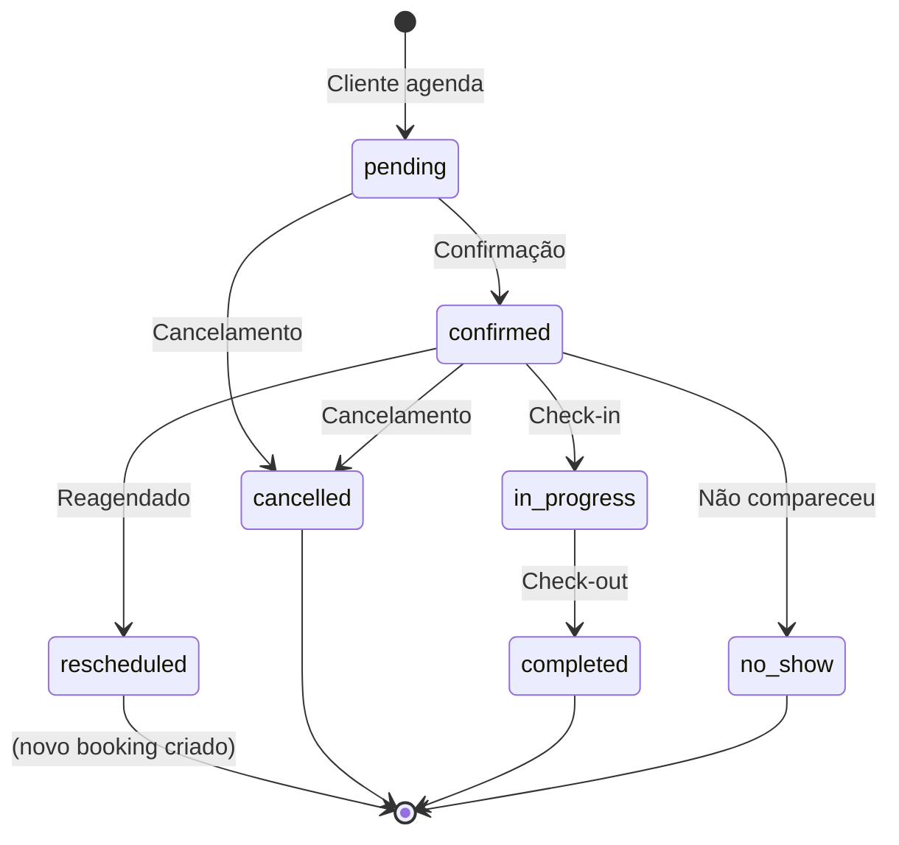

# 📅 Módulo de Agendamento — Documentação

> **Versão:** 1.0.0 | **Data:** Julho 2026 | **Módulo:** `app.modules.scheduling`

---

## 1. Visão Geral

O módulo de agendamento é o **coração do sistema**. Implementa uma agenda inteligente inspirada em **Calendly** (disponibilidade), **Google Calendar** (smart suggestions) e **Microsoft Bookings** (waitlist auto-promotion).

### 5 Diferenciais

| # | Diferencial | Descrição |
|---|-------------|-----------|
| **1** | **Availability Engine** | Calcula disponibilidade real em UMA query: jornada + time-off + bloqueios + bookings existentes |
| **2** | **Smart Slot Suggestions** | Sugere os MELHORES horários, não apenas disponíveis: evita gaps, prioriza mesmo profissional |
| **3** | **Idempotency Keys** | Anti double-booking: mesmo se cliente clicar 2x, só 1 booking é criado |
| **4** | **Waitlist Auto-Promotion** | Ao cancelar, notifica automaticamente a fila com janela de aceitação |
| **5** | **State Machine + Audit Trail** | Cada transição de status gera log imutável append-only |

---

## 2. Arquitetura

```
app/modules/scheduling/
├── domain/
│   ├── entities.py          # Service, Booking (AR), BlockedDate, WaitlistEntry
│   ├── value_objects.py     # TimeSlot, ServicePricing, BookingSlot, AvailabilityResult
│   ├── enums.py             # BookingStatus, BookingSource, BlockType, WaitlistStatus
│   └── interfaces.py        # 9 ports (incluindo IAvailabilityEngine)
├── application/
│   ├── scheduling_service.py  # SchedulingService — orquestração completa
│   └── dto.py               # 20+ DTOs
├── infrastructure/
│   ├── models/              # 9 modelos SQLAlchemy
│   ├── repository.py        # 7 repositórios
│   └── availability_engine.py  # CORAÇÃO: cálculo de disponibilidade
└── presentation/
    └── routes.py            # 25+ endpoints REST
```

---

## 3. Máquina de Estados do Booking



Cada transição gera um `BookingStatusLog` imutável (auditoria completa).

---

## 4. Availability Engine

### Como Funciona

```
1. Busca jornada do profissional (StaffSchedule ou BusinessHours)
2. Busca time-offs aprovados no período
3. Busca blocked dates (feriados, manutenções)
4. Busca bookings existentes (pending, confirmed, in_progress)
5. Para cada dia no range:
   - Verifica se é dia de trabalho
   - Remove time-off dates
   - Remove blocked dates
   - Remove slots ocupados por bookings
   - Remove horário de almoço
   - Retorna slots disponíveis
```

### Performance

- **1 query** para jornada + **1 query** para time-offs + **1 query** para bloqueios + **1 query** para bookings
- Tempo alvo: **<50ms** para 30 dias de disponibilidade
- Unique constraint `(professional_id, booking_date, start_time)` previne double-booking no banco

---

## 5. Smart Suggestions

Heurísticas de ranqueamento:

| Critério | Score |
|----------|:-----:|
| Profissional preferido (última visita) | +10 |
| Meio da manhã (9h-11h) ou meio da tarde (14h-16h) | +5 |
| Hora cheia ou meia hora | +2 |
| Hoje ou amanhã | +3 |
| Horário de almoço (11h-13h) | -3 |

---

## 6. Como Evitar Conflitos

| Camada | Mecanismo |
|--------|-----------|
| **Aplicação** | `AvailabilityEngine` verifica slots antes de criar |
| **Aplicação** | `IdempotencyKey` previne duplicação por clique duplo |
| **Banco** | `UNIQUE(professional_id, booking_date, start_time)` — última linha de defesa |
| **Banco** | `status IN (pending, confirmed, in_progress)` — bookings ativos bloqueiam slot |

---

## 7. Como Escalar

| Estratégia | Impacto |
|------------|---------|
| **Índices compostos** | `(professional_id, booking_date, start_time)` para queries de agenda |
| **Range queries** | `date_from/date_to` limitam o scan a períodos específicos |
| **Cache Redis** | Serviços e categorias com TTL 5 min |
| **Batch operations** | Upsert de professional-services em lote |
| **Paginação** | Todas as listagens com offset/limit |

---

## 8. Como Novos Módulos Usam

```python
# Módulo de Notificações (futuro):
booking = await scheduling_service.get_booking(booking_id)
# Enviar WhatsApp: "Seu horário com {professional} está confirmado para {date} às {time}"

# Módulo de Pagamentos (futuro):
booking = await scheduling_service.complete_booking(booking_id)
# Disparar cobrança via gateway de pagamento

# Site Público (futuro):
slots = await scheduling_service.get_availability(
    tenant_id, professional_id, date_from, date_to, service_ids,
)
# Renderizar grade de horários disponíveis
```
